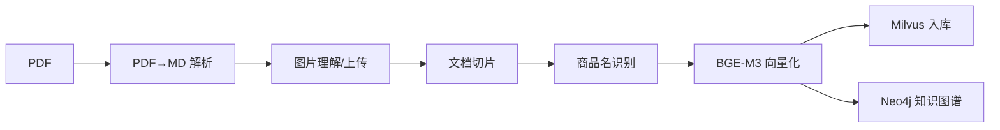
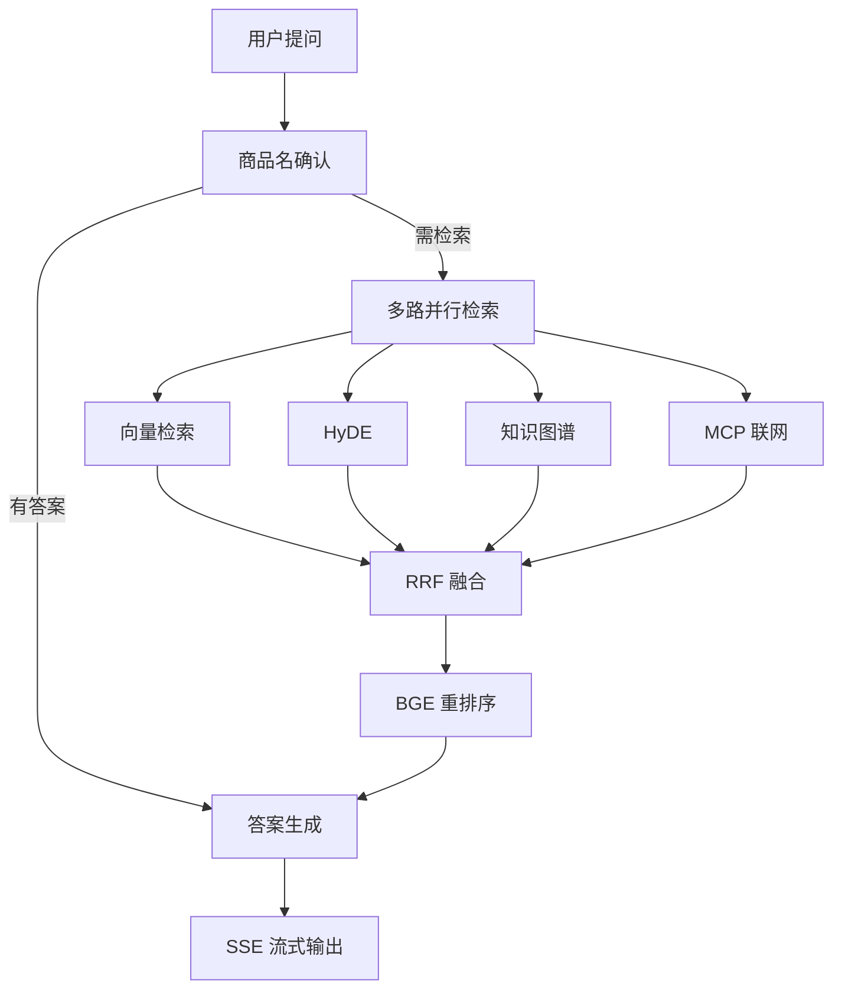

# 掌柜智库 · Shopkeeper Knowledge Base

> 面向**商品说明书 / 技术文档**的 RAG 知识库系统：上传 PDF 自动解析入库，提问时多路混合检索 + 重排序，由大模型给出带来源依据的回答。

一套从「文档导入」到「智能问答」完整打通的检索增强生成（RAG）实践项目，包含**混合检索**、**知识图谱**、**HyDE**、**MCP 联网搜索**与**流式输出**。

---

## ✨ 核心特性

**文档导入侧**
- **PDF → Markdown**：集成 MinerU 解析，保留标题层级、表格与图片
- **图片理解**：调用视觉语言模型（VLM）为插图自动生成中文描述，并上传 MinIO 回填到 Markdown
- **结构化切片**：按标题层级切分，长章节二次切分、短章节自动合并
- **商品名识别**：LLM 抽取 + 向量检索双重确认，自动归一化商品名称
- **BGE-M3 混合向量**：同时生成稠密（语义）+ 稀疏（关键词）向量，兼顾语义与精确匹配
- **知识图谱**：抽取实体与关系写入 Neo4j，支持图谱检索

**问答检索侧**
- **商品名确认**：先识别用户问的是哪个商品，模糊时给出候选供选择
- **四路并行检索**：向量检索 / HyDE 假设文档 / 知识图谱 / MCP 联网搜索
- **RRF 融合 + BGE 重排序**：多路结果倒数排序融合，再用 Reranker 精排
- **SSE 流式输出**：Server-Sent Events 实时推送节点进度与答案增量
- **会话历史**：MongoDB 持久化多轮对话

---

## 🏗 技术架构

```
┌─────────────────────────────────────────────────────────────┐
│                      前端 (chat.html / import.html)           │
└────────────────────────┬────────────────────────────────────┘
                         │ HTTP / SSE
┌────────────────────────┴────────────────────────────────────┐
│                    FastAPI 服务层                             │
│         import_router (:8000)      query_router (:8001)      │
└──────────┬─────────────────────────────────┬────────────────┘
           │                                 │
┌──────────┴──────────────┐      ┌───────────┴────────────────┐
│    导入流程 (LangGraph)   │      │    查询流程 (LangGraph)      │
│  PDF解析 → 图片理解       │      │  商品名确认 → 多路并行检索    │
│  → 切片 → 商品名识别      │      │  → RRF融合 → 重排序 → 生成   │
│  → 向量化 → 入库/图谱     │      │                             │
└──────────┬──────────────┘      └───────────┬────────────────┘
           │                                 │
┌──────────┴─────────────────────────────────┴────────────────┐
│                      存储与模型层                             │
│   Milvus(向量)  Neo4j(图谱)  MongoDB(历史)  MinIO(文件)        │
│   BGE-M3(本地嵌入)  BGE-Reranker(本地重排)  LLM/VLM(云端)     │
└─────────────────────────────────────────────────────────────┘
```

### 导入流程



### 查询流程



---

## 🛠 技术栈

| 领域 | 选型 |
|---|---|
| Web 框架 | FastAPI + Uvicorn |
| 流程编排 | LangGraph |
| LLM 接入 | OpenAI 兼容接口（**云端 API**：可对接百炼 / DeepSeek / 本地 vLLM） |
| 嵌入模型 | **BGE-M3**（本地推理：稠密 + 稀疏混合向量） |
| 重排序 | **BGE-Reranker-v2-m3**（本地推理） |
| 向量数据库 | Milvus |
| 图数据库 | Neo4j |
| 文档存储 | MongoDB（会话历史）、MinIO（文件对象） |
| PDF 解析 | **MinerU**（本地 CLI，模型来自 ModelScope） |
| 实时推送 | Server-Sent Events (SSE) |

---

> 💡 本项目 **LLM / VLM（视觉语言模型）** 走云端 OpenAI 兼容接口（百炼 / DeepSeek / 本地 vLLM 均可），需填写 API Key；其余 **三个推理模型全部本地运行**，无需联网、不消耗云端额度。

### 🧠 本地模型组件（3 个）

| 模型 | 作用 | 加载方式 | 关键配置 |
|---|---|---|---|
| **MinerU** | PDF → Markdown 解析（保留标题层级 / 表格 / 图片） | 本地 CLI `mineru` 命令（独立安装，非 Python 依赖） | `MINERU_MODEL_SOURCE=modelscope`、`MODELSCOPE_CACHE` 缓存目录 |
| **BGE-M3** | 文本嵌入，同时产出稠密向量（语义）+ 稀疏向量（关键词） | `pymilvus.model.hybrid.BGEM3EmbeddingFunction` 本地加载 | `BGE_M3_PATH`（默认 `BAAI/bge_m3`）、`BGE_DEVICE` |
| **BGE-Reranker-v2-m3** | 多路检索结果精排打分，决定最终送入 LLM 的段落 | `FlagEmbedding.FlagReranker` 本地加载 | `BGE_RERANKER_PATH`（默认 `BAAI/bge-reranker-v2-m3`）、`BGE_RERANKER_DEVICE` |

首次运行会自动从 **ModelScope / HuggingFace** 拉取上述权重并缓存到 `./model_cache`（由 `MODELSCOPE_CACHE` / `HF_HOME` 控制）。需要完全离线时：先在有网环境拉取一次，再把 `.env` 中 `MODELSCOPE_OFFLINE` 设为 `1` 即可。

---

## 🚀 快速开始

### 1. 环境准备

- **Docker & Docker Compose** — 用于一键启动下面四个基础服务
- **MinerU** — PDF 解析（独立 CLI，非 Python 依赖）：`pip install mineru`

四个外部服务已全部编排进 `docker-compose.yml`，无需手动安装：

| 服务 | 用途 | 端口 |
|---|---|---|
| Milvus 3.0（含 etcd + 专用存储） | 向量数据库 | 19530 |
| Neo4j 5.26 LTS | 知识图谱 | 7474 / 7687 |
| MongoDB 7.0 | 会话历史 | **27018**（避开本机已装的 27017，可用 `MONGO_PORT` 覆盖） |
| MinIO | 图片/文件对象存储 | 9000 / 9001 |

### 2. 启动外部服务（Docker Compose）

```bash
# 在项目根目录执行，拉起全部依赖服务
docker compose up -d

# 查看状态，等待全部变为 healthy（Milvus 首次启动约需 1 分钟）
docker compose ps

# 一键自检：四个服务是否连通、配置是否填对
python scripts/check_env.py
```

> - MinIO 容器启动时会自动建桶 `shopkeeper-kb` 并设为公开读，无需手动初始化。
> - 本机已装 MongoDB 且想继续用它：`docker compose up -d milvus neo4j minio minio-init`（跳过 mongodb）。
> - 彻底清理数据：`docker compose down -v`。

### 3. 安装依赖

```bash
python -m venv .venv
.venv\Scripts\activate        # Windows
# source .venv/bin/activate  # Linux / macOS

pip install -r requirements.txt
```

> `pymilvus[model]` 会连带安装 `torch`，体积较大，请预留磁盘空间与下载时间。

### 4. 配置

```bash
cp .env.example knowledge/.env
```

然后编辑 `knowledge/.env`，填入你自己的密钥与服务地址（该文件已被 `.gitignore` 忽略，不会提交）。
默认值与 `docker-compose.yml` 已对齐：除了 LLM 的 API Key，其余服务配置开箱即用，无需修改。

### 5. 启动服务

在项目**根目录**下执行：

```bash
# 文档导入服务（端口 8000）
python -m knowledge.api.import_router

# 智能问答服务（端口 8001）
python -m knowledge.api.query_router
```

打开浏览器访问：

- 导入页面：<http://localhost:8000/import>
- 问答页面：<http://localhost:8001/chat.html>

---

## 📡 API 文档

启动后自动生成的交互式文档：

- 导入服务：<http://localhost:8000/docs>
- 问答服务：<http://localhost:8001/docs>

### 导入服务 `:8000`

| 方法 | 路径 | 说明 |
|---|---|---|
| GET | `/` | 首页 |
| GET | `/import` | 导入页面 |
| POST | `/upload` | 上传文档并触发导入流程 |
| GET | `/status/{task_id}` | 查询导入任务进度 |

### 问答服务 `:8001`

| 方法 | 路径 | 说明 |
|---|---|---|
| GET | `/chat.html` | 问答页面 |
| POST | `/query` | 提交问题（支持 `is_stream` 流式） |
| GET | `/stream/{task_id}` | SSE 流式接收进度与答案 |
| GET | `/history/{session_id}` | 获取会话历史 |
| DELETE | `/history/{session_id}` | 清空会话历史 |

**提交问题示例**

```bash
curl -X POST http://localhost:8001/query \
  -H "Content-Type: application/json" \
  -d '{"query": "RS-12 数字万用表如何测量电压？", "is_stream": false}'
```

---

## 📊 检索效果评测

内置 `eval/` 评测框架（30 条正例 + 3 条负例，人工标注自真实切片），量化检索质量而不是凭感觉调参：

```bash
python eval/run_eval.py                # 向量检索 vs 混合检索+BGE重排 两种模式对比
python eval/run_eval.py --self-test    # 无服务自检：只验证指标计算
```

输出指标：

| 指标 | 含义 |
|---|---|
| Hit@k | 期望段落出现在 top-k 的比例 |
| Recall@k | 期望段落被覆盖的比例（多答案题更有区分度） |
| MRR@5 | 第一个命中结果排名倒数的均值 |
| nDCG@5 | 折损累积增益，综合衡量排序位置质量 |

每次运行会在 `eval/reports/` 留下 Markdown 报告，逐条展示命中位次，方便定位 badcase。评测集格式见 `eval/retrieval_eval_set.json`，新增商品文档后按同样格式追加用例即可。

---

## 📁 项目结构

```
Shopkeeper_Knowledge_Base/
├── knowledge/
│   ├── api/                          # FastAPI 路由层
│   │   ├── import_router.py          #   文档导入服务 (:8000)
│   │   └── query_router.py           #   智能问答服务 (:8001)
│   ├── core/                         # 基础设施层
│   │   ├── config.py                 #   .env 唯一加载入口（load_env）
│   │   ├── connections.py            #   Milvus/Neo4j/Mongo/MinIO 线程安全单例
│   │   ├── app_factory.py            #   FastAPI 应用工厂（CORS/静态资源/启动自检）
│   │   ├── exceptions.py             #   流程异常统一基类
│   │   ├── logging.py                #   统一日志配置
│   │   ├── deps.py                   #   依赖注入
│   │   └── paths.py                  #   路径配置
│   ├── domain/                       # 领域层（导入/查询共用）
│   │   ├── kg_schema.py              #   图结构单一事实来源：白名单/Cypher/常量
│   │   └── kg_query.py               #   查询侧 KG 组件（实体抽取/对齐/图读取/chunk回填）
│   ├── schema/                       # Pydantic 数据模型
│   ├── services/                     # 业务逻辑层
│   ├── prompts/                      # Prompt 模板
│   ├── front/                        # 前端页面
│   ├── processor/
│   │   ├── base.py                   # 共享节点基类（日志/任务追踪/SSE进度/异常包装）
│   │   ├── import_process/           # 导入流程 (LangGraph)
│   │   │   └── nodes/                #   PDF解析/图片/切片/商品名/向量化/入库/图谱
│   │   └── query_process/            # 查询流程 (LangGraph)
│   │       └── nodes/                #   商品名确认/向量/HyDE/图谱/MCP/RRF/重排/输出
│   └── utils/                        # 工具层：Milvus/Neo4j/Mongo/MinIO/SSE/Embedding
├── eval/                             # 检索效果评测（Recall@K / MRR / nDCG）
├── tests/                            # 单元测试（纯函数逻辑，不依赖外部服务）
├── requirements.txt                  # 运行依赖（已钉版本）
├── requirements-dev.txt              # 开发依赖（pytest / ruff）
├── pyproject.toml                    # pytest / ruff / mypy 配置
├── .env.example                      # 配置模板
└── README.md
```

---

## 🧑‍💻 开发

```bash
pip install -r requirements-dev.txt

python -m pytest -q                # 单元测试（纯函数逻辑，秒级）
python -m ruff check .             # Lint
python eval/run_eval.py --self-test
```

约束：
- **配置加载**只允许经 `knowledge/core/config.py` 的 `load_env()`（`knowledge/__init__.py` 已自动触发），业务模块禁止再调 `load_dotenv`。
- **外部连接**（Milvus/Neo4j/Mongo/MinIO）统一经 `knowledge/core/connections.py` 获取，线程安全、懒加载。
- **图结构**（实体/关系白名单、Cypher 语句）统一维护在 `knowledge/domain/kg_schema.py`，导入写入与查询读取共用同一套定义。

---

## ❓ 常见问题

**Q：`ModuleNotFoundError: No module named 'xxx'`**

项目启动时会在导入阶段一次性加载完整链路（含 BGE-M3、Neo4j、Milvus、MCP 等），缺少任一依赖都会报错。按提示 `pip install` 对应包即可，或重新执行 `pip install -r requirements.txt`。

**Q：embedding 报 `input must be an array of strings`**

LangChain 的 `OpenAIEmbeddings` 接非官方 OpenAI 端点时会先把文本 tokenize 成 ID 数组再发送，部分兼容端点不接受。初始化时加 `check_embedding_ctx_length=False` 即可。

**Q：BGE-M3 稀疏向量报 `'coo_array' object has no attribute 'indptr'`**

不同版本 `encode_documents` 返回的稀疏矩阵格式不一致（`coo_array` / `csr`）。读取 `.indptr` / `.indices` 前先统一 `.tocsr()`。

**Q：MongoDB 连接超时 `ServerSelectionTimeoutError`**

`MongoClient` 是懒连接，构造时不联网，首次数据库操作才真正建连。请确认服务地址可达、`mongod` 在运行、`bindIp` 允许远程连接、防火墙放行 27017。

---

## 🗺 Roadmap

- [x] Docker Compose 一键部署（`docker-compose.yml` + `scripts/check_env.py` 环境自检）
- [x] 检索效果评测集与自动化评估（`eval/`，Recall@K / MRR / nDCG）
- [ ] 多文档批量导入与增量更新
- [ ] 检索结果溯源高亮（定位到原文段落）
- [ ] 支持更多文档格式（Word / Excel / HTML）
- [ ] 用户与权限体系

---

## 📄 License

MIT
